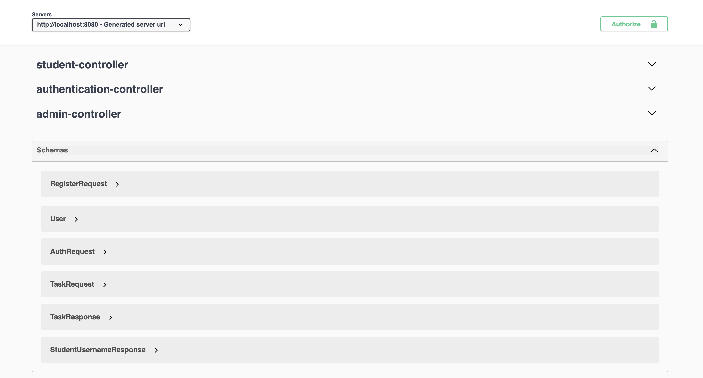

# 📝 Student Task Management System

A role-based task management system built with Spring Boot, where Admins can assign and manage tasks, and Students can view and update their task statuses. Secure authentication is handled using JWT tokens, and API documentation is available via Swagger UI.

---

## 🔧 Tech Stack

- Java 17+
- Spring Boot 3
- Spring Security (JWT)
- MySQL
- Lombok
- Swagger / OpenAPI
- Maven
- Docker 

---

## 🚀 Features

### 🛡️ Authentication
- Secure login using JWT token.
- Role-based access control using Spring Security.

### 👤 Admin Features
- Register new Admins and Students.
- View all students.
- Assign tasks to students.
- Delete student users.

### 🎓 Student Features
- View assigned tasks.
- Update task status (e.g., Pending, Completed).

---

## 📦 Project Structure

src  
├── main  
│   ├── java  
│   │   └── com.student.taskmanagement  
│   │       ├── controller  
│   │       ├── service  
│   │       ├── model  
│   │       ├── dto  
│   │       ├── filter  
│   │       ├── config  
│   │       └── security  
│   └── resources  
│       ├── application.properties  
│       └── schema.sql (optional)

---

## 🧪 How to Run

### 🔸 Prerequisites

- Java 17+
- MySQL
- Postman or Swagger UI

### 🔹 Steps

1. Clone the repository:

   git clone https://github.com/jaseem1033/student-task-manager.git  
   cd student-task-manager

2. Configure your MySQL database in `src/main/resources/application.properties`:

   spring.datasource.url=jdbc:mysql://localhost:3306/your_db_name  
   spring.datasource.username=your_username  
   spring.datasource.password=your_password

3. Run the app using Maven:

   ./mvnw spring-boot:run

4. Open Swagger UI in your browser:

   http://localhost:8080/swagger-ui/index.html

---

## 🐳 How to Run with Docker

You can run the entire application including MySQL using Docker and Docker Compose.
### 📦 Prerequisites

- Docker installed
- Docker Compose installed

### ▶️ Steps to Run

1. Clone the repository:

   ```bash
   git clone https://github.com/jaseem1033/student-task-manager.git
   cd student-task-manager
2. Run the Docker containers:
   ```
   docker-compose up --build

3. The application will be available at:
http://localhost:8080


4. Swagger UI (API Docs) will be available at:
http://localhost:8080/swagger-ui/index.html


5. MySQL will run in a separate container. Default credentials:

      Host: localhost
      
      Port: 3306
      
      Username: root
      
      Password: dockerpass

📌 Note: If you want to customize DB credentials, update them in docker-compose.yml and application.properties accordingly.

---
## 📸 API Documentation (Swagger UI)


Once the server is running, visit: [http://localhost:8080/swagger-ui/index.html](http://localhost:8080/swagger-ui/index.html)

### 🔍 Swagger UI Preview




## 🔑 Sample Test Flow

1. Register a new Admin:  
   POST /api/admin/register

2. Login and generate a token:  
   POST /api/auth/login

3. Use the token in request headers:  
   Authorization: Bearer <your_token_here>

4. Admin Endpoints:
   - POST /api/admin/tasks
   - DELETE /api/admin/register/{username}

5. Student Endpoints:
   - GET /api/tasks/user/{username}
   - POST /api/tasks/status/{taskId}/{status}

---

## 📄 License

This project is open-sourced for educational purposes only.

---

## 🙋‍♂️ Author

**Jaseem**  
GitHub: https://github.com/jaseem1033
